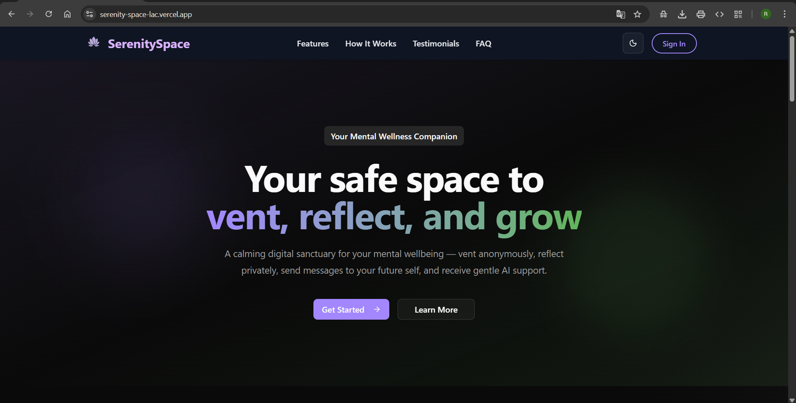

<p align="center">
  
</p>

<h1 align="center">SerenitySpace</h1>

<p align="center">
  <strong>Your digital sanctuary for mental wellbeing.</strong><br/>
  Vent freely. Reflect deeply. Send hope to your future self. Talk to an AI that cares.
</p>

<p align="center">
  
  
  
  
  
  
  
  
</p>

<p align="center">
  <a href="https://serenity-space-lac.vercel.app">
    
  </a>
</p>

---

## Table of Contents

- [About](#about)
- [Demo](#demo)
- [Features](#features)
- [Tech Stack](#tech-stack)
- [Getting Started](#getting-started)
- [License](#license)
- [Author](#author)

---

## About

**SerenitySpace** is a full-stack mental wellness platform designed to give people a safe, judgment-free environment to process their emotions.

It's not just another journaling app — it's a thoughtfully designed emotional toolkit that combines:

- **Anonymous venting** with community visibility
- **Private reflections** with tag & emotion-based journaling
- **Time-capsule messages** delivered to your future self in real-time
- **An empathetic AI companion** powered by Google Gemini

Every pixel, every animation, and every backend decision was made with one goal: **make the user feel safe, heard, and supported.**

---

## Demo

<p align="center">
  <a href="https://www.youtube.com/watch?v=0SwPKFJsP1k">
    
  </a>
  <br/><em>▶️ Click to watch the full demo on YouTube</em>
</p>

---

## Features

### 🗣️ Vent Room

> Let it out. No filters. No judgment.

- Write short emotional vents (up to 1000 characters)
- Choose a mood: `happy`, `sad`, `angry`, `anxious`, `neutral`
- Toggle between **public** (anonymous, visible to all) and **private**
- Filter by mood, switch between "All Vents" and "My Vents"
- Full CRUD with ownership-based edit/delete controls

### 📝 Reflection Space

> Your private journal — reflect, explore, and grow.

- Long-form journaling (up to 2500 characters)
- Tag your reflections for easy retrieval
- Emotion classification with color-coded badges
- Filter by emotion or tag
- Completely private — only you can see your reflections

### 💌 Message Vault

> A little message to your future self.

- Write a message and schedule it for any future date
- **Real-time delivery** via Socket.IO when the time arrives
- Delivered messages get a green highlight pulse animation
- Edit scheduled messages (only if not yet delivered)
- Separate "Upcoming" and "Delivered" sections with live countdown
- Fallback polling every 10 seconds for reliability

### 🤖 SerenityBot (AI Companion)

> A compassionate AI that listens.

- Floating chatbot widget accessible from the dashboard
- Powered by **Google Gemini 2.5 Flash**
- Maintains per-user conversation history with 30-min session TTL
- Responds with empathy, warmth, and no medical advice
- Typing dots animation, clear chat option
- Stale session cleanup every 10 minutes

### 📊 Dashboard

> Your personal command center.

- Personalized welcome with username
- Quick-access cards to Vent Room, Reflection Space, and Message Vault
- Live stats showing latest vent, latest reflection, and last delivered message
- Smooth staggered animations on load

### 🔐 Authentication

> Secure, seamless, and smart.

- Register with email, username, and password
- Login with email **or** username
- JWT dual-token system (access: 1 day, refresh: 10 days)
- Automatic token refresh on 401 responses
- Password change, profile update, account deletion (cascading)
- Protected route redirect with session expiry toast

### 🌓 Theme System

> Light and dark, designed with care.

- System-aware theme detection
- Smooth animated toggle (sun/moon rotation with spring physics)
- Consistent across all components

---

## Tech Stack

### Frontend

| Technology                | Purpose                                              |
| ------------------------- | ---------------------------------------------------- |
| **Next.js 15**            | App Router, Turbopack, SSR-ready framework           |
| **React 19**              | UI library with latest concurrent features           |
| **TypeScript**            | Full type safety across the frontend                 |
| **Tailwind CSS v4**       | Utility-first styling with oklch color system        |
| **Framer Motion**         | Page transitions, staggered lists, spring animations |
| **shadcn/ui + Radix**     | Accessible, composable UI primitives                 |
| **React Hook Form + Zod** | Performant forms with schema validation              |
| **Socket.IO Client**      | Real-time vault message delivery                     |
| **Axios**                 | HTTP client with interceptor-based token refresh     |
| **Sonner**                | Beautiful toast notifications                        |
| **next-themes**           | System-aware dark/light mode                         |

### Backend

| Technology               | Purpose                                     |
| ------------------------ | ------------------------------------------- |
| **Express 5**            | Minimal, fast Node.js web framework         |
| **MongoDB + Mongoose**   | Document database with schema validation    |
| **JWT (jsonwebtoken)**   | Stateless auth with access + refresh tokens |
| **bcrypt**               | Password hashing (salt rounds: 10)          |
| **Socket.IO**            | WebSocket server for real-time events       |
| **node-cron**            | Scheduled message delivery (every 60s)      |
| **Google Generative AI** | Gemini 2.5 Flash for the AI chatbot         |
| **cookie-parser**        | HTTP-only cookie management                 |
| **CORS**                 | Cross-origin configuration                  |

---

## Getting Started

### Prerequisites

- **Node.js** >= 18
- **MongoDB** Atlas
- **Google Gemini API Key**

### 1. Clone the Repository

```bash
git clone https://github.com/rishank14/SerenitySpace.git
cd SerenitySpace
```

### 2. Setup the Backend

```bash
cd server
npm install
```

Create a `.env` file in the `server/` directory:

```env
PORT=7000
MONGODB_URI=mongodb+srv://<username>:<password>@cluster.mongodb.net/serenityspace
ACCESS_TOKEN_SECRET=your_access_token_secret_here
ACCESS_TOKEN_EXPIRY=1d
REFRESH_TOKEN_SECRET=your_refresh_token_secret_here
REFRESH_TOKEN_EXPIRY=10d
CORS_ORIGIN=http://localhost:3000
GEMINI_API_KEY=your_gemini_api_key_here
NODE_ENV=development
```

Start the server:

```bash
npm run dev
```

The backend will be running at `http://localhost:7000`

### 3. Setup the Frontend

```bash
cd client
npm install
```

Create a `.env.local` file in the `client/` directory:

```env
NEXT_PUBLIC_API_BASE_URL=http://localhost:7000/api/v1
```

Start the frontend:

```bash
npm run dev
```

The app will be running at `http://localhost:3000`

---

## License

This project is licensed under the [MIT License](LICENSE).

---

## Author

**Rishank Kalra**

Built with care, code, and a passion for mental wellbeing.

---

<p align="center">
  <strong>SerenitySpace</strong> — Because everyone deserves a safe space to feel. 💜
</p>
